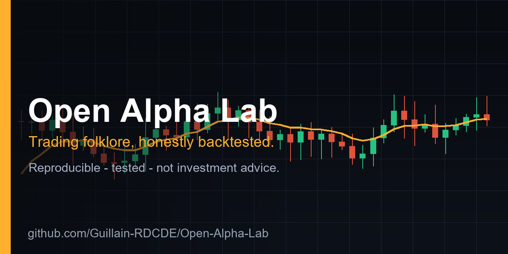
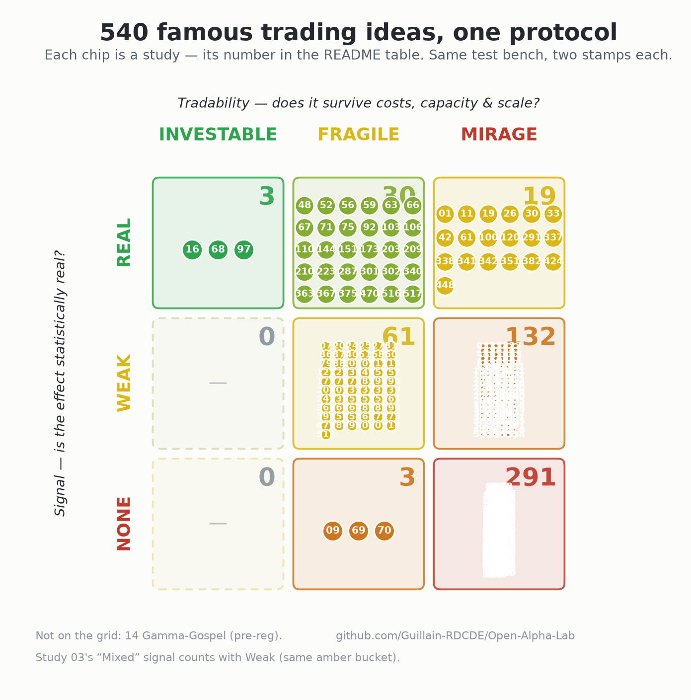

<div align="center">



# Open-Alpha-Lab

### Out of 450 famous trading edges, three survive — and none of them predicts returns.

That's not a typo. I put every market anomaly, folk strategy and named factor
people swear by through the **same brutal protocol**, and publish the verdict: **edge or mirage.**

`500 tested` · `3 survive` · `407 mirages` · `0 forecast returns`

***Most are mirages. The honest write-up of why is the point — and the survivors size risk, they don't see the future.***

[](https://github.com/Guillain-RDCDE/Open-Alpha-Lab/actions/workflows/tests.yml)
[](https://www.python.org/)
[](LICENSE)

</div>

---

> Built by someone who ran the real thing — a fully systematic global-macro book scaled
> from sub-\$100M to **\$9B+ in monthly traded notional** — so every idea is judged on the
> two questions most repos skip: **is the signal real?** *and* **does it survive real
> execution and scale?**

## The protocol

Every idea goes through the *same* protocol and earns **two stamps**, so results are comparable:

| | |
|---|---|
| **Signal** — is the effect statistically real? |    |
| **Tradability** — does it survive costs, capacity & scale? |    |

Robust inference (Newey-West / Lo SEs, bootstrap CIs, White Reality Check for data-snooping),
an honest alpha-vs-beta split, and a square-root market-impact capacity test — the full house
style is written up in **[METHODOLOGY.md](METHODOLOGY.md)**.

---

## The graveyard

The whole bench on one grid — every study is a numbered chip, sorted by its two stamps.
Almost everything ends up bottom-right; three chips are green — and none of them predicts returns.

[](https://guillain-rdcde.github.io/Open-Alpha-Lab/)

> **▶ [Explore the live map](https://guillain-rdcde.github.io/Open-Alpha-Lab/)** — the same grid, but zoomable:
> **click any chip to open its study**, search by name or claim, and filter the whole bench by verdict.
> (The static image above never gets less readable; the interactive page is where it scales.)

The counts, the mortality by family of idea, and the five lessons the bench keeps
teaching are in **[What 540 teardowns taught us](docs/bench.md)**.

---

## The body count

Prefer a table to a map? The **[same live page](https://guillain-rdcde.github.io/Open-Alpha-Lab/)** also lists every
study in a sortable grid — search by name or claim, filter by verdict, click straight through to the teardown.
The full table below is the single source of truth (it's what the map and the live page are built from) — it's long, so it's folded.

**Start here — the bench's only greens** (real signal *and* tradable; tellingly, none forecasts returns):

| # | Study | Why it's green |
|:--:|---|---|
| **[16](studies/16-storm-shy/)** | **Storm-Shy** | Scales exposure *down* in turbulence — risk management, not a return forecast. |
| **[68](studies/68-all-weather/)** | **All-Weather** | Risk parity — diversification, not a signal. |
| **[97](studies/97-balancing-act/)** | **Balancing-Act** | Plain 60/40 rebalancing. |

<details>
<summary><b>The full ledger — every study, two stamps each</b> &nbsp;·&nbsp; click to expand</summary>

<br>

| # | Study | The claim — tested to destruction | Real? | Tradable? |
|:--:|---|---|:--:|:--:|
| **[01](studies/01-overnight-anomaly/)** | **Overnight Anomaly** | Do stocks really make all their money overnight? |  |  |
| **[02](studies/02-falling-knife/)** | **Falling-Knife** | Does buying the dip (−3%) beat a random day? |  |  |
| **[03](studies/03-fear-gauge/)** | **Fear-Gauge** | Does buying the VIX spike pay? |  |  |
| **[04](studies/04-social-oracle/)** | **Social-Oracle** | Does following a viral crowd's stock picks pay? |  |  |
| **[05](studies/05-twin-spread/)** | **Twin-Spread** | Does textbook pairs trading still pay after everyone copied it? |  |  |
| **[06](studies/06-clockwork-vol/)** | **Clockwork-Vol** | Does the VIX run on a fixed-period cycle you can time? |  |  |
| **[07](studies/07-coiled-spring/)** | **Coiled-Spring** | Does the "20-EMA breakout" deliver explosive +30% pops? |  |  |
| **[08](studies/08-true-strength/)** | **True-Strength** | Is the "True" Strength Index truer than MACD/RSI? |  |  |
| **[09](studies/09-phantom-kernel/)** | **Phantom-Kernel** | Is Avellaneda-Stoikov's "optimal spread" built on a real order-arrival law — and does it matter to the P&L? |  |  |
| **[10](studies/10-markov-mint/)** | **Markov-Mint** | Can a Markov-chain pipeline "win every trade" on Polymarket? |  |  |
| **[11](studies/11-vanishing-penny/)** | **Vanishing-Penny** | How fast does a guaranteed \$40M Polymarket arbitrage close? |  |  |
| **[12](studies/12-paper-prophet/)** | **Paper-Prophet** | Does an ARIMA+GARCH stack forecast the SPY, or is it vol-targeting in a trenchcoat? |  |  |
| **[13](studies/13-crimson-hour/)** | **Crimson-Hour** | Does a red opening hour + IB-rejection really call the close at 88%? |  |  |
| **[14](studies/14-gamma-gospel/)** | **Gamma-Gospel** | Does dealer gamma (GEX) call the day's character, or is it the VIX in a trenchcoat? |  |  |
| **[15](studies/15-sigma-sleight/)** | **Sigma-Sleight** | Does length-aware "AdaptiveRSI" beat fixed 70/30, or is the σ-transform a monotone relabel? |  |  |
| **[16](studies/16-storm-shy/)** | **Storm-Shy** | Does scaling exposure down when markets get loud actually pay — or is it just selling low? |  |  |
| **[17](studies/17-glass-ceiling/)** | **Glass-Ceiling** | Does a 1:1 resistance breakout have momentum to harvest, or are you just paying the spread to buy the high? |  |  |
| **[18](studies/18-dull-roar/)** | **Dull-Roar** | The low-volatility anomaly: free alpha on the modern S&P 500, or just a defensive low-beta tilt? |  |  |
| **[19](studies/19-rubber-band/)** | **Rubber-Band** | Internal Bar Strength: does a stock that closes near its low really snap back the next day — and can you still cash it? |  |  |
| **[20](studies/20-freight-train/)** | **Freight-Train** | Time-series momentum: does riding the trend across many markets pay — and why would you hold a thin-Sharpe sleeve? |  |  |
| **[21](studies/21-fools-gold/)** | **Fools-Gold** | The "golden cross" (50/200 MA): is it a real buy signal, or a trend filter that only shines on the one index everyone quotes? |  |  |
| **[22](studies/22-crystal-ball/)** | **Crystal-Ball** | An HP-filter detrending strategy backtests at Sharpe 2 — on a coin flip. Is it an edge, or is the filter peeking at the future? |  |  |
| **[23](studies/23-broken-tether/)** | **Broken-Tether** | Pairs trading: two assets drift apart, bet they snap back — but does the cointegration hold out of sample? |  |  |
| **[24](studies/24-stampede/)** | **Stampede** | Cross-sectional momentum: do past winners keep winning on the modern S&P 500 — and what does the crash cost? |  |  |
| **[25](studies/25-clean-slate/)** | **Clean-Slate** | Residual momentum — is the "cleaner cousin" of cross-sectional momentum actually cleaner on this tape? |  |  |
| **[26](studies/26-sand-castle/)** | **Sand-Castle** | A "mathematically optimal" stat-arb portfolio (w ∝ C⁻¹E) backtests beautifully — does inverting an estimated covariance help, or maximize the error? |  |  |
| **[27](studies/27-steamroller/)** | **Steamroller** | The FX carry trade — borrow cheap, lend dear: a real premium, or rent paid in front of a steamroller? |  |  |
| **[28](studies/28-carousel/)** | **Carousel** | Sector rotation: does chasing the hottest sectors beat just holding all eleven equal-weight — or is it concentration risk for nothing? |  |  |
| **[29](studies/29-hedgers-toll/)** | **Hedgers-Toll** | Are speculators really paid (via CFTC positioning) for taking the other side of producers' commodity hedges — or has the toll booth closed? |  |  |
| **[30](studies/30-house-edge/)** | **House-Edge** | Lever a vol-targeted dip-buyer to beat the market — does the edge survive the retail CFD markup? |  |  |
| **[31](studies/31-trade-winds/)** | **Trade-Winds** | Cross-asset time-series momentum — the cliché closest to surviving: does our 26-year tape certify it, or only the crisis-alpha sleeve? |  |  |
| **[32](studies/32-rip-tide/)** | **Rip-Tide** | Short-term contrarian on the same 18 futures as Trade-Winds — same machine, opposite sign: does fading the move pay net of turnover? |  |  |
| **[33](studies/33-slingshot/)** | **Slingshot** | The equity mirror of Rip-Tide — fade each stock against its peers (dollar-neutral): a real reversal, or eaten by the spread? |  |  |
| **[34](studies/34-aftershock/)** | **Aftershock** | Post-earnings drift — the decades-old premium: does it survive on a liquid S&P 500 universe after costs? |  |  |
| **[35](studies/35-contango/)** | **Contango** | Commodity carry / roll yield — long backwardation, short contango: is the contango tax harvestable, or a −83%-drawdown curve-timing book? |  |  |
| **[36](studies/36-greenback/)** | **Greenback** | Dollar-carry, and the carry⊕momentum combo: can diversification fix the steamroller a vol overlay couldn't? |  |  |
| **[37](studies/37-barometer/)** | **Barometer** | The trend in macro data (growth, inflation) as a cross-asset signal: right-sided, but big and fast enough to trade? |  |  |
| **[38](studies/38-chorus/)** | **Chorus** | The capstone — blend three weak, decorrelated signals (momentum + reversal + low-vol): do they add up to one tradable book? |  |  |
| **[39](studies/39-black-box/)** | **Black-Box** | A neural net fed crypto OHLCV scores a dazzling in-sample Sharpe: does it survive walk-forward, or is it memorising noise? |  |  |
| **[40](studies/40-paper-tiger/)** | **Paper-Tiger** | A vendor's published dual-momentum backtest, mirrored back: is the timing alpha real, or does it belong to the assets it holds? |  |  |
| **[41](studies/41-hangover/)** | **Hangover** | The January Barometer ("as goes January, so goes the year"): a real omen, or a base-rate illusion? |  |  |
| **[42](studies/42-last-call/)** | **Last-Call** | The turn-of-the-month effect — real, large and famous: can you actually beat buy-and-hold with it? |  |  |
| **[43](studies/43-free-lunch/)** | **Free-Lunch** | Betting against beta — the "low-risk free lunch": is it free, or is it the leverage bill? |  |  |
| **[44](studies/44-growth-spurt/)** | **Growth-Spurt** | The asset-growth effect — the highest headline Sharpe on the vendor list: does it survive look-ahead-free on large caps? |  |  |
| **[45](studies/45-vanishing-act/)** | **Vanishing-Act** | The size premium (Banz 1981), finance's original factor: is it still there on the longest free proxy? |  |  |
| **[46](studies/46-bargain-bin/)** | **Bargain-Bin** | The value premium (HML) on tradable value/growth ETF pairs: a dependable edge, or a regime bet? |  |  |
| **[47](studies/47-paper-moon/)** | **Paper-Moon** | The Fed Model (E/P vs the 10-year yield): a real timing rule, or a money-illusion bug? |  |  |
| **[48](studies/48-groundhog/)** | **Groundhog** | Return seasonality — a stock repeats its calendar-month performance (Heston-Sadka): real signal, or astrology? |  |  |
| **[49](studies/49-black-gold/)** | **Black-Gold** | Does the oil price predict the stock market (Driesprong 2008) — still, out of sample? |  |  |
| **[50](studies/50-high-water/)** | **High-Water** | The 52-week-high effect (George-Hwang): a distinct anomaly, or just momentum wearing a hat? |  |  |
| **[51](studies/51-blue-chip/)** | **Blue-Chip** | The quality (gross-profitability) premium — the factor that survived where size and value faded (Novy-Marx): does it, on real SEC data? |  |  |
| **[52](studies/52-smoke-screen/)** | **Smoke-Screen** | The accruals anomaly (Sloan 1996) — cash-backed earnings beat accrual-heavy ones: does it replicate on real SEC data? |  |  |
| **[53](studies/53-jackpot/)** | **Jackpot** | The lottery (MAX) effect — high single-day-gain stocks should underperform (Bali et al.): do they, on large caps? |  |  |
| **[54](studies/54-static/)** | **Static** | The idiosyncratic-volatility puzzle (high-vol → low returns, Ang et al.): does it hold on large caps? |  |  |
| **[55](studies/55-summer-lull/)** | **Summer-Lull** | "Sell in May" — the Halloween seasonal: real enough to beat buy-and-hold? |  |  |
| **[56](studies/56-tide-table/)** | **Tide-Table** | Does the Shiller CAPE forecast long-run returns — and can it time the market, or only set expectations? |  |  |
| **[57](studies/57-yield-trap/)** | **Yield-Trap** | Do high-dividend stocks beat the market on total return? |  |  |
| **[58](studies/58-bunker/)** | **Bunker** | Does the min-vol ETF (USMV) deliver the low-vol anomaly — free Sharpe, or just less risk? |  |  |
| **[59](studies/59-downhill/)** | **Downhill** | Riding the yield curve for the term premium: real, but worth the duration risk? |  |  |
| **[60](studies/60-long-shot/)** | **Long-Shot** | The skewness (lottery) effect in commodities — low-skew beats high-skew: does it point the right way, and pay? |  |  |
| **[61](studies/61-slow-burn/)** | **Slow-Burn** | Do 3× leveraged ETFs (TQQQ) decay to zero or amplify — and is there a free lunch? |  |  |
| **[62](studies/62-premium-seller/)** | **Premium-Seller** | Does a covered-call "income" ETF (QYLD) beat the index it holds? |  |  |
| **[63](studies/63-free-fall/)** | **Free-Fall** | The short-volatility carry — selling vol earns a real premium: can you keep it through the steamroller? |  |  |
| **[64](studies/64-share-shuffle/)** | **Share-Shuffle** | Do firms that issue stock underperform the ones buying it back (the net-issuance anomaly) — on large caps? |  |  |
| **[65](studies/65-scorecard/)** | **Scorecard** | Does Piotroski's 9-point F-score (the famous fundamental-health screen) sort large-cap winners? |  |  |
| **[66](studies/66-inverted/)** | **Inverted** | Does an inverted yield curve forecast equity downturns — and is it a usable sell button? |  |  |
| **[67](studies/67-fed-drift/)** | **Fed-Drift** | Do stocks drift up before FOMC meetings (Lucca-Moench) — still, after everyone knows? |  |  |
| **[68](studies/68-all-weather/)** | **All-Weather** | Does Dalio's risk-parity portfolio beat everything, or just diversify better? |  |  |
| **[69](studies/69-safe-haven/)** | **Safe-Haven** | Does gold hedge inflation and crashes — or one, or neither? |  |  |
| **[70](studies/70-digital-gold/)** | **Digital-Gold** | Is bitcoin "digital gold" — a crash-and-inflation haven, or just a high-octane risk asset? |  |  |
| **[71](studies/71-ambush/)** | **Ambush** | Four edges that each died to daily turnover (low IBS, turn-of-month, red close, VIX stress), gated to fire only at their rare confluence: does the overlay pay? |  |  |
| **[72](studies/72-loaded-dice/)** | **Loaded-Dice** | The 5-minute SMA(5/10) crossover scalp — "a coin flip with the trend on your side": is the trend really on your side? |  |  |
| **[73](studies/73-first-light/)** | **First-Light** | Does the 5-minute opening-range breakout earn the returns its viral 2023 backtest claims? |  |  |
| **[74](studies/74-mind-the-gap/)** | **Mind-the-Gap** | Does an opening gap always get filled? |  |  |
| **[75](studies/75-knee-jerk/)** | **Knee-Jerk** | Does Connors' RSI(2) oversold bounce still pay — or did publishing it wear it out? |  |  |
| **[76](studies/76-rice-paper/)** | **Rice-Paper** | Do Japanese candlestick reversals predict anything a coin doesn't? |  |  |
| **[77](studies/77-golden-mean/)** | **Golden-Mean** | Do Fibonacci levels and round numbers hold better than random price levels? |  |  |
| **[78](studies/78-crossed-wires/)** | **Crossed-Wires** | Is the MACD crossover any more than a slower coin flip? |  |  |
| **[79](studies/79-sleigh-ride/)** | **Sleigh-Ride** | Is the Santa Claus rally real — and does a failed one warn of trouble ahead? |  |  |
| **[80](studies/80-cold-open/)** | **Cold-Open** | Does January's direction really call the rest of the year? |  |  |
| **[81](studies/81-four-year-itch/)** | **Four-Year-Itch** | Is year three of the presidential cycle really the market's best? |  |  |
| **[82](studies/82-witching-hour/)** | **Witching-Hour** | Does triple-witching expiry move the market, or just the volume? |  |  |
| **[83](studies/83-half-life/)** | **Half-Life** | Does Bitcoin reliably pump after each four-year halving? |  |  |
| **[84](studies/84-moon-math/)** | **Moon-Math** | Does the Stock-to-Flow model actually predict Bitcoin's price? |  |  |
| **[85](studies/85-dr-copper/)** | **Dr-Copper** | Does the copper/gold ratio forecast the economy, or just echo it? |  |  |
| **[86](studies/86-tail-radar/)** | **Tail-Radar** | Does the CBOE SKEW index see black swans coming? |  |  |
| **[87](studies/87-center-line/)** | **Center-Line** | Does price really get pulled back to the intraday VWAP? |  |  |
| **[88](studies/88-dogs-of-the-dow/)** | **Dogs-of-the-Dow** | Buy the ten highest-yielding Dow stocks each January — do you really beat the Dow? |  |  |
| **[89](studies/89-turn-of-the-month/)** | **Turn-of-the-Month** | Do almost all the market's gains really land in the ~4 days around month-end? |  |  |
| **[90](studies/90-weekend/)** | **Weekend** | Are Mondays really negative, and does buying Tuesday beat the market? |  |  |
| **[91](studies/91-death-cross/)** | **Death-Cross** | When the 50-day crosses below the 200-day, should you really sell? |  |  |
| **[92](studies/92-easy-money/)** | **Easy-Money** | Vol ETPs bleed lower every day — so can you just short them and collect free money? |  |  |
| **[93](studies/93-round-numbers/)** | **Round-Numbers** | Prices pile up at whole dollars — but can you trade the magnetism? |  |  |
| **[94](studies/94-level-pegging/)** | **Level-Pegging** | Does equal-weighting the S&P *always* beat cap-weighting? |  |  |
| **[95](studies/95-holiday-cheer/)** | **Holiday-Cheer** | Do stocks really pop the day before every market holiday — and can you buy it? |  |  |
| **[96](studies/96-new-year-pop/)** | **New-Year-Pop** | Do small-cap stocks really pop versus large caps every January? |  |  |
| **[97](studies/97-balancing-act/)** | **Balancing-Act** | Is the classic 60/40 portfolio the sensible default — and do bonds really cushion every crash? |  |  |
| **[98](studies/98-high-noon/)** | **High-Noon** | Is buying at an all-time high really the riskiest moment to invest? |  |  |
| **[99](studies/99-safety-net/)** | **Safety-Net** | Does a trailing stop-loss really protect your capital and improve returns? |  |  |
| **[100](studies/100-melting-ice/)** | **Melting-Ice** | Do 3x ETFs like TQQQ really "decay to zero", so you must never hold them overnight? |  |  |
| **[101](studies/101-slow-and-steady/)** | **Slow-and-Steady** | Dollar-cost averaging: safer *and* smarter than going all-in, or just a way to stay less invested? |  |  |
| **[102](studies/102-free-rebalance/)** | **Free-Rebalance** | Is rebalancing really a free lunch that adds return on top of the risk control? |  |  |
| **[103](studies/103-turtle-trader/)** | **Turtle-Trader** | Did the legendary Turtle breakout actually beat entering at random? |  |  |
| **[104](studies/104-bollinger-reversion/)** | **Bollinger-Reversion** | Does piercing the lower Bollinger band beat just buying a random day? |  |  |
| **[105](studies/105-coppock-curve/)** | **Coppock-Curve** | Can a 1962 indicator built for grief really time bear-market bottoms? |  |  |
| **[106](studies/106-supertrend/)** | **Supertrend** | Does TradingView's most-watched ATR flip actually beat a coin? |  |  |
| **[107](studies/107-stochastic-oscillator/)** | **Stochastic-Oscillator** | Does the stochastic oversold crossover beat a coin? |  |  |
| **[108](studies/108-adx-filter/)** | **ADX-Filter** | Does "only trade when the trend is strong" (ADX > 25) add anything? |  |  |
| **[109](studies/109-obv-divergence/)** | **OBV-Divergence** | Does on-balance volume really precede price? |  |  |
| **[110](studies/110-faber-timing/)** | **Faber-Timing** | Does the famous 200-day timing rule beat buy-and-hold, or just cut risk? |  |  |
| **[111](studies/111-vix-term-structure/)** | **VIX-Term-Structure** | Does the VIX term-structure slope time the market? |  |  |
| **[112](studies/112-move-index/)** | **Move-Index** | Does bond-market volatility (MOVE) warn of equity drawdowns? |  |  |
| **[113](studies/113-gold-silver-ratio/)** | **Gold-Silver-Ratio** | Does the gold/silver ratio reliably mean-revert into a trade? |  |  |
| **[114](studies/114-dollar-smile/)** | **Dollar-Smile** | Does the dollar's direction forecast stocks, or just move with them? |  |  |
| **[115](studies/115-credit-spreads/)** | **Credit-Spreads** | Does widening high-yield credit warn equities before they fall? |  |  |
| **[116](studies/116-power-hour/)** | **Power-Hour** | Does the last "power hour" continue the day's move — or fade it? |  |  |
| **[117](studies/117-pi-cycle-top/)** | **Pi-Cycle-Top** | Does Bitcoin's Pi-Cycle Top indicator really call the top? |  |  |
| **[118](studies/118-fed-model/)** | **Fed-Model** | Does the earnings yield minus the 10-year bond yield tell you when to own stocks? |  |  |
| **[119](studies/119-real-rate-regime/)** | **Real-Rate-Regime** | Should you step aside when real long rates are high or rising? |  |  |
| **[120](studies/120-excess-cape-yield/)** | **Excess-CAPE-Yield** | Does Shiller's ECY forecast the next decade's equity risk premium? |  |  |
| **[121](studies/121-magic-formula/)** | **Magic-Formula** | Does Greenblatt's quality-plus-value rank beat the S&P 500? |  |  |
| **[122](studies/122-gross-profitability/)** | **Gross-Profitability** | Does Novy-Marx's gross profitability still earn a spread on large caps? |  |  |
| **[123](studies/123-altman-z/)** | **Altman-Z** | Do financially distressed (low Altman-Z) stocks pay a premium? |  |  |
| **[124](studies/124-cash-flow-yield/)** | **Cash-Flow-Yield** | Does buying high operating-cash-flow yield beat plain earnings yield? |  |  |
| **[125](studies/125-ichimoku-cloud/)** | **Ichimoku-Cloud** | Does the Ichimoku cloud system beat a coin? |  |  |
| **[126](studies/126-parabolic-sar/)** | **Parabolic-SAR** | Does Wilder's stop-and-reverse flip beat a coin once you pay the whipsaws? |  |  |
| **[127](studies/127-williams-r/)** | **Williams-R** | Does the Williams %R oversold signal predict a bounce? |  |  |
| **[128](studies/128-keltner-channel/)** | **Keltner-Channel** | Keltner breakout or Keltner reversion — is either one signal? |  |  |
| **[129](studies/129-heikin-ashi/)** | **Heikin-Ashi** | Do smoothed Heikin-Ashi candles filter noise into an edge? |  |  |
| **[130](studies/130-vol-risk-premium/)** | **Vol-Risk-Premium** | Is selling the gap between implied and realized vol a free lunch? |  |  |
| **[131](studies/131-utilities-canary/)** | **Utilities-Canary** | Do utilities leading the market warn of a coming drawdown? |  |  |
| **[132](studies/132-yield-curve-steepener/)** | **Yield-Curve-Steepener** | Does the curve slope tell you when to own the long bond? |  |  |
| **[133](studies/133-crypto-seasonality/)** | **Crypto-Seasonality** | Is "Uptober" — or any month — a real edge in Bitcoin? |  |  |
| **[134](studies/134-bitcoin-dominance/)** | **Bitcoin-Dominance** | Does falling Bitcoin dominance call "alt season"? |  |  |
| **[135](studies/135-fomc-cycle/)** | **FOMC-Cycle** | Do stock returns really hide in the even weeks of the Fed cycle? |  |  |
| **[136](studies/136-mark-twain/)** | **Mark-Twain** | Is October really the most dangerous month to own stocks? |  |  |
| **[137](studies/137-mansfield-rs/)** | **Mansfield-RS** | Does Weinstein's Stage-2 relative-strength screen beat the market? |  |  |
| **[138](studies/138-random-forest/)** | **Random-Forest** | Does a walk-forward Random Forest on price features beat a shuffled-label control? |  |  |
| **[139](studies/139-ai-powered-etf/)** | **AI-Powered-ETF** | Can IBM Watson's AI ETF beat a dirt-cheap S&P 500 index fund? |  |  |
| **[140](studies/140-amihud-illiquidity/)** | **Amihud-Illiquidity** | Does sorting on price-impact illiquidity earn a premium, or just survivorship? |  |  |
| **[141](studies/141-turnover-anomaly/)** | **Turnover-Anomaly** | Do low-turnover stocks deliver the Datar-Naik-Radcliffe liquidity premium? |  |  |
| **[142](studies/142-split-drift/)** | **Split-Drift** | Do stocks drift up after a split takes effect? |  |  |
| **[143](studies/143-dividend-capture/)** | **Dividend-Capture** | Can you pocket a dividend by buying just before the ex-date? |  |  |
| **[144](studies/144-permanent-portfolio/)** | **Permanent-Portfolio** | Does Harry Browne's four-way mix really survive every regime? |  |  |
| **[145](studies/145-home-bias/)** | **Home-Bias** | Does diversifying abroad still improve a US investor's portfolio? |  |  |
| **[146](studies/146-country-momentum/)** | **Country-Momentum** | Does rotating into the strongest-trending country ETFs pay? |  |  |
| **[147](studies/147-fx-momentum/)** | **FX-Momentum** | Does currency momentum still pay after costs? |  |  |
| **[148](studies/148-lunar-effect/)** | **Lunar-Effect** | Do stocks really return less around the full moon? |  |  |
| **[149](studies/149-daylight-saving/)** | **Daylight-Saving** | Does the market really slump after the clocks change? |  |  |
| **[150](studies/150-sad-effect/)** | **SAD-Effect** | Do shorter autumn days really depress stock returns? |  |  |
| **[151](studies/151-stocks-for-long-run/)** | **Stocks-For-Long-Run** | Do stocks really always win over the long run? |  |  |
| **[152](studies/152-inflation-hedge/)** | **Inflation-Hedge** | Are stocks really an inflation hedge? |  |  |
| **[153](studies/153-net-operating-assets/)** | **Net-Operating-Assets** | Does a bloated balance sheet predict low returns? |  |  |
| **[154](studies/154-leverage-anomaly/)** | **Leverage-Anomaly** | Do high-leverage firms earn the higher return theory promises? |  |  |
| **[155](studies/155-asset-turnover/)** | **Asset-Turnover** | Do capital-efficient (high asset-turnover) firms beat the market? |  |  |
| **[156](studies/156-martingale/)** | **Martingale** | Does averaging down ("martingale") beat just buying and holding? |  |  |
| **[157](studies/157-kelly-sizing/)** | **Kelly-Sizing** | Does Kelly-optimal position sizing beat fixed sizing in practice? |  |  |
| **[158](studies/158-super-bowl/)** | **Super-Bowl** | Can a football game predict the stock market? |  |  |
| **[159](studies/159-presidential-party/)** | **Presidential-Party** | Do stocks really do better under Democrats — or did the crashes just land on one party's watch? |  |  |
| **[160](studies/160-skyscraper-curse/)** | **Skyscraper-Curse** | Does the world's next record skyscraper signal a crash? |  |  |
| **[161](studies/161-year-ending-five/)** | **Year-Ending-Five** | Are years ending in 5 really the best for stocks? |  |  |
| **[162](studies/162-rosh-hashanah/)** | **Rosh-Hashanah** | Should you really "sell Rosh Hashanah, buy Yom Kippur"? |  |  |
| **[163](studies/163-friday-13th/)** | **Friday-13th** | Is Friday the 13th unlucky for the stock market? |  |  |
| **[164](studies/164-mercury-retrograde/)** | **Mercury-Retrograde** | Does Mercury retrograde really wreck the market? |  |  |
| **[165](studies/165-chinese-zodiac/)** | **Chinese-Zodiac** | Is the Year of the Dragon lucky for stocks? |  |  |
| **[166](studies/166-first-five-days/)** | **First-Five-Days** | Do January's first five days really forecast the whole year? |  |  |
| **[167](studies/167-hindenburg-omen/)** | **Hindenburg-Omen** | Does the Hindenburg Omen actually warn of crashes? |  |  |
| **[168](studies/168-advance-decline/)** | **Advance-Decline** | Does a fading advance-decline line call the top? |  |  |
| **[169](studies/169-fluent-tickers/)** | **Fluent-Tickers** | Do stocks with pronounceable tickers outperform? |  |  |
| **[170](studies/170-alphabetical-bias/)** | **Alphabetical-Bias** | Do early-alphabet tickers get an edge? |  |  |
| **[171](studies/171-naive-1-over-n/)** | **Naive-1-Over-N** | Does "optimal" portfolio math beat a naive equal split? |  |  |
| **[172](studies/172-hundred-minus-age/)** | **Hundred-Minus-Age** | Is "100 minus your age in stocks" smart, or just less invested? |  |  |
| **[173](studies/173-four-percent-rule/)** | **Four-Percent-Rule** | Does the 4% retirement withdrawal rule actually survive history? |  |  |
| **[174](studies/174-bitcoin-rainbow/)** | **Bitcoin-Rainbow** | Does Bitcoin's Rainbow Chart actually time the cycle? |  |  |
| **[175](studies/175-crypto-weekend/)** | **Crypto-Weekend** | Is there a tradable Bitcoin weekend effect? |  |  |
| **[176](studies/176-hot-hand/)** | **Hot-Hand** | After a winning streak, is the market "hot" — or "due" for a reversal? |  |  |
| **[177](studies/177-megacap-concentration/)** | **Megacap-Concentration** | Does just buying the biggest stocks beat the index? |  |  |
| **[178](studies/178-cci/)** | **CCI** | Does Lambert's CCI oscillator time daily equities? |  |  |
| **[179](studies/179-aroon/)** | **Aroon** | Does Chande's Aroon(25) crossover point the right way? |  |  |
| **[180](studies/180-trix/)** | **TRIX** | Does triple-smoothing an EMA filter false signals, or just delay the good ones? |  |  |
| **[181](studies/181-ultimate-oscillator/)** | **Ultimate-Oscillator** | Does Williams' three-period oscillator beat a coin at the extremes? |  |  |
| **[182](studies/182-vortex-indicator/)** | **Vortex-Indicator** | Does the VI+/VI- crossover call the daily trend? |  |  |
| **[183](studies/183-fisher-transform/)** | **Fisher-Transform** | Does Ehlers' Fisher Transform sharpen turning points into an edge? |  |  |
| **[184](studies/184-williams-fractals/)** | **Williams-Fractals** | Do Bill Williams' fractals mark tradable swing points? |  |  |
| **[185](studies/185-chande-momentum/)** | **Chande-Momentum** | Does the Chande Momentum Oscillator beat a coin? |  |  |
| **[186](studies/186-morning-star/)** | **Morning-Star** | Does the morning-star candle pattern call a reversal? |  |  |
| **[187](studies/187-three-soldiers/)** | **Three-Soldiers** | Do three white soldiers (or black crows) predict what comes next? |  |  |
| **[188](studies/188-head-shoulders/)** | **Head-Shoulders** | Does the head-and-shoulders pattern actually forecast the drop? |  |  |
| **[189](studies/189-double-top/)** | **Double-Top** | Do double tops and bottoms call reversals? |  |  |
| **[190](studies/190-nr7/)** | **NR7** | Does the narrowest range in 7 days precede a tradable breakout? |  |  |
| **[191](studies/191-leap-year/)** | **Leap-Year** | Are leap years good or bad for stocks? |  |  |
| **[192](studies/192-tax-day/)** | **Tax-Day** | Is there a tax-day effect around April 15? |  |  |
| **[193](studies/193-window-dressing/)** | **Window-Dressing** | Do funds pump winners into quarter-end — and can you trade it? |  |  |
| **[194](studies/194-turkey/)** | **Turkey** | Do stocks really feast around Thanksgiving? |  |  |
| **[195](studies/195-monthly-opex/)** | **Monthly-OpEx** | Does monthly options-expiration week move the market? |  |  |
| **[196](studies/196-long-term-reversal/)** | **Long-Term-Reversal** | Do five-year losers really beat five-year winners (De Bondt-Thaler)? |  |  |
| **[197](studies/197-dividend-payout-ratio/)** | **Dividend-Payout-Ratio** | Does a higher payout ratio really predict higher growth (Arnott-Asness)? |  |  |
| **[198](studies/198-cash-holdings/)** | **Cash-Holdings** | Do cash-rich firms earn higher returns? |  |  |
| **[199](studies/199-sales-growth/)** | **Sales-Growth** | Do fast-growing "glamour" stocks underperform (Lakonishok-Shleifer-Vishny)? |  |  |
| **[200](studies/200-roe-quality/)** | **ROE-Quality** | Does buying high-ROE quality beat the market? |  |  |
| **[201](studies/201-dividend-growth/)** | **Dividend-Growth** | Do dividend growers outperform? |  |  |
| **[202](studies/202-fifty-two-week-low/)** | **Fifty-Two-Week-Low** | Does buying stocks near their 52-week low pay? |  |  |
| **[203](studies/203-golden-butterfly/)** | **Golden-Butterfly** | Does the Golden Butterfly beat plain stocks — and its simpler parent? |  |  |
| **[204](studies/204-talmud-portfolio/)** | **Talmud-Portfolio** | Does a 2,000-year-old "thirds" rule still hold up? |  |  |
| **[205](studies/205-three-fund/)** | **Three-Fund** | Is the Bogleheads three-fund portfolio actually better than 100% stocks? |  |  |
| **[206](studies/206-dividend-aristocrats/)** | **Dividend-Aristocrats** | Do the Dividend Aristocrats beat the market? |  |  |
| **[207](studies/207-reits-diversifier/)** | **REITs-Diversifier** | Are REITs a real diversifier, or just leveraged stocks? |  |  |
| **[208](studies/208-gold-miners/)** | **Gold-Miners** | Are gold miners really leveraged gold? |  |  |
| **[209](studies/209-eth-btc-ratio/)** | **ETH-BTC-Ratio** | Can you ride the ETH/BTC rotation? |  |  |
| **[210](studies/210-crypto-trend/)** | **Crypto-Trend** | Does a 200-day timing rule tame Bitcoin's crashes? |  |  |
| **[211](studies/211-sin-stocks/)** | **Sin-Stocks** | Do vice stocks really beat the virtuous market? |  |  |
| **[212](studies/212-cannabis-stocks/)** | **Cannabis Stocks** | Did the green rush ever pay, or only shred wealth? |  |  |
| **[213](studies/213-meme-stocks/)** | **Meme Stocks** | Could you ride the meme mania, or only be its exit liquidity? |  |  |
| **[214](studies/214-magazine-cover-curse/)** | **Magazine-Cover-Curse** | When a magazine calls the top, is the move already over? |  |  |
| **[215](studies/215-big-mac-ppp/)** | **Big-Mac-PPP** | Does the Big Mac index predict which currencies revert? |  |  |
| **[216](studies/216-hemline-index/)** | **Hemline-Index** | Do rising skirts really ring the market bell? |  |  |
| **[217](studies/217-lipstick-index/)** | **Lipstick Index** | Does lipstick spending warn of a coming recession? |  |  |
| **[218](studies/218-spac-performance/)** | **SPAC-Performance** | Were SPACs a shortcut to public markets or a rigged loss? |  |  |
| **[219](studies/219-ipo-pop/)** | **IPO-Pop** | Chase the IPO pop, or does the hangover always win? |  |  |
| **[220](studies/220-small-dogs/)** | **Small Dogs of the Dow** | Do the five cheapest Dogs beat the full ten? |  |  |
| **[221](studies/221-mayer-multiple/)** | **Mayer-Multiple** | Does the Mayer Multiple tell you when Bitcoin is cheap? |  |  |
| **[222](studies/222-altseason-rotation/)** | **Altseason-Rotation** | Can BTC dominance time the rotation into altcoins? |  |  |
| **[223](studies/223-same-month-seasonality/)** | **Same-Month Seasonality** | Does a stock keep winning in the same month it always has? |  |  |
| **[224](studies/224-monday-effect/)** | **Monday Effect** | Is Monday still the market's worst day? |  |  |
| **[225](studies/225-sector-rotation/)** | **Sector-Rotation** | Can you rotate into the right sector for each cycle phase? |  |  |
| **[226](studies/226-crude-seasonality/)** | **Crude-Seasonality** | Does crude really rally into summer driving season? |  |  |
| **[227](studies/227-natgas-winter/)** | **Natgas-Winter** | Is the winter gas spike tradable, or a widow-maker? |  |  |
| **[228](studies/228-pre-earnings-runup/)** | **Pre-Earnings Runup** | Do stocks drift up in the days before earnings? |  |  |
| **[229](studies/229-beneish-m-score/)** | **Beneish M-score** | Can the Beneish M-score sniff out earnings manipulators? |  |  |
| **[230](studies/230-ohlson-o-score/)** | **Ohlson O-score** | Does the Ohlson O-score price distress any better? |  |  |
| **[231](studies/231-sloan-accruals/)** | **Sloan Accruals** | Do high-accrual firms underperform the cash earners? |  |  |
| **[232](studies/232-mohanram-g-score/)** | **Mohanram G-score** | Can the Mohanram G-score find growth that delivers? |  |  |
| **[233](studies/233-shareholder-yield/)** | **Shareholder-Yield** | Is total shareholder yield the dividend factor done right? |  |  |
| **[234](studies/234-olympic-year/)** | **Olympic-Year** | Do stocks win gold in Olympic years? |  |  |
| **[235](studies/235-world-cup-effect/)** | **World-Cup-Effect** | Does the World Cup summer really sink the market? |  |  |
| **[236](studies/236-fifty-two-week-high/)** | **Fifty-Two-Week-High** | Is nearness to the 52-week high a better momentum signal? |  |  |
| **[237](studies/237-residual-momentum/)** | **Residual-Momentum** | Does residual-return momentum dodge the crashes? |  |  |
| **[238](studies/238-betting-against-beta/)** | **Betting-Against-Beta** | Does leveraging low-beta and shorting high-beta print money? |  |  |
| **[239](studies/239-spinoffs/)** | **Spinoffs** | Do corporate spin-offs really outrun the market? |  |  |
| **[240](studies/240-dividend-initiation/)** | **Dividend-Initiation** | Do first-time dividend payers signal a re-rating? |  |  |
| **[241](studies/241-buy-the-dip/)** | **Buy-the-Dip** | Does buying the dip beat just staying invested? |  |  |
| **[242](studies/242-quality-minus-junk/)** | **Quality-Minus-Junk** | Does Quality-minus-Junk survive outside the backtest? |  |  |
| **[243](studies/243-graham-ncav/)** | **Graham NCAV** | Do Graham net-nets still exist and still pay? |  |  |
| **[244](studies/244-asset-growth/)** | **Asset-Growth** | Do fast-growing-asset firms underperform the disciplined ones? |  |  |
| **[245](studies/245-oil-equity-correlation/)** | **Oil-Equity Correlation** | Does the oil price lead the stock market, or just move with it? |  |  |
| **[246](studies/246-defensive-sectors/)** | **Defensive-Sectors Leadership** | Do staples and utilities leading warn of risk-off? |  |  |
| **[247](studies/247-bond-seasonality/)** | **Bond-Seasonality** | Do Treasuries have their own calendar? |  |  |
| **[248](studies/248-presidential-honeymoon/)** | **Presidential-Honeymoon** | Does the market enjoy a new president's first 100 days? |  |  |
| **[249](studies/249-index-inclusion/)** | **Index-Inclusion** | Is there still a free pop when a stock joins the S&P 500? |  |  |
| **[250](studies/250-reverse-split/)** | **Reverse-Split** | Is a reverse split the kiss of death it's reputed to be? |  |  |
| **[251](studies/251-crypto-reversal/)** | **Crypto-Reversal** | Is the crypto reversal premium real, or just momentum? |  |  |
| **[252](studies/252-google-trends/)** | **Search-Trends** | Do spikes in Google searches for stock names front-run their returns? |  |  |
| **[253](studies/253-wikipedia-views/)** | **Wiki-Views** | Do surging Wikipedia page-views on tickers predict the next move? |  |  |
| **[254](studies/254-wsb-mentions/)** | **WSB-Mentions** | Does the r/WallStreetBets mention count call the meme move? |  |  |
| **[255](studies/255-fear-greed-index/)** | **Fear-Greed** | Can CNN's Fear & Greed Index time the market? |  |  |
| **[256](studies/256-twitter-mood/)** | **Twitter-Mood** | Does aggregate Twitter mood predict tomorrow's market? |  |  |
| **[257](studies/257-aaii-sentiment/)** | **AAII-Sentiment** | Is the AAII bull-bear survey a contrarian timing tool? |  |  |
| **[258](studies/258-baker-wurgler/)** | **Baker-Wurgler** | Does the Baker-Wurgler sentiment index forecast returns? |  |  |
| **[259](studies/259-news-tone/)** | **News-Tone** | Does aggregate news tone move the next day's tape? |  |  |
| **[260](studies/260-margin-debt/)** | **Margin-Debt** | Is record NYSE margin debt a contrarian sell signal? |  |  |
| **[261](studies/261-put-call-ratio/)** | **Put-Call-Ratio** | Does the CBOE put/call ratio time market bottoms? |  |  |
| **[262](studies/262-short-interest/)** | **Short-Interest** | Do heavily shorted stocks bounce or bleed? |  |  |
| **[263](studies/263-insider-buying/)** | **Insider-Buying** | Does aggregate insider buying (Form 4) forecast returns? |  |  |
| **[264](studies/264-buffett-indicator/)** | **Buffett-Indicator** | Does market-cap-to-GDP tell you when to leave the party? |  |  |
| **[265](studies/265-ipo-volume/)** | **IPO-Volume** | Is a flood of IPOs the bell at the top? |  |  |
| **[266](studies/266-misery-index/)** | **Misery-Index** | Does the misery index (inflation+unemployment) call equity returns? |  |  |
| **[267](studies/267-m2-growth/)** | **M2-Growth** | Does money-supply (M2) growth drive the stock market? |  |  |
| **[268](studies/268-sahm-rule/)** | **Sahm-Rule** | Is the Sahm recession trigger a usable sell button? |  |  |
| **[269](studies/269-baltic-dry/)** | **Baltic-Dry** | Does the Baltic Dry shipping index lead the stock market? |  |  |
| **[270](studies/270-underwear-index/)** | **Underwear-Index** | Does men's-underwear sales (Greenspan) signal the economy? |  |  |
| **[271](studies/271-cardboard-box/)** | **Cardboard-Box** | Does cardboard-box / rail-freight output forecast the cycle? |  |  |
| **[272](studies/272-champagne-index/)** | **Champagne-Index** | Does champagne consumption mark the top? |  |  |
| **[273](studies/273-lego-returns/)** | **Lego-Returns** | Do retired Lego sets beat the stock market? |  |  |
| **[274](studies/274-fine-wine/)** | **Fine-Wine** | Does fine wine (Liv-ex 100) diversify or just lag? |  |  |
| **[275](studies/275-whisky-cask/)** | **Whisky-Cask** | Are whisky casks the alternative asset they're sold as? |  |  |
| **[276](studies/276-sneaker-resale/)** | **Sneaker-Resale** | Does the sneaker resale market (StockX) beat stocks? |  |  |
| **[277](studies/277-trading-cards/)** | **Trading-Cards** | Are Pokemon/sports cards an investable asset class? |  |  |
| **[278](studies/278-sunshine-effect/)** | **Sunshine-Effect** | Does NYC sunshine lift the NYSE? |  |  |
| **[279](studies/279-geomagnetic-storms/)** | **Geomagnetic-Storms** | Do geomagnetic storms depress returns? |  |  |
| **[280](studies/280-solar-eclipse/)** | **Solar-Eclipse** | Do solar eclipses spook the market? |  |  |
| **[281](studies/281-el-nino/)** | **El-Nino** | Does El Nino / La Nina move equities or commodities? |  |  |
| **[282](studies/282-nyc-temperature/)** | **NYC-Temperature** | Does the temperature on Wall Street move the tape? |  |  |
| **[283](studies/283-hurricane-season/)** | **Hurricane-Season** | Does Atlantic hurricane season sink stocks? |  |  |
| **[284](studies/284-equinox-effect/)** | **Equinox-Effect** | Do equinoxes and solstices mark turning points? |  |  |
| **[285](studies/285-st-patricks-day/)** | **St-Patricks-Day** | Is there a St. Patrick's Day bump? |  |  |
| **[286](studies/286-valentines-day/)** | **Valentines-Day** | Does the market love Valentine's Day? |  |  |
| **[287](studies/287-easter-effect/)** | **Easter-Effect** | Is there a Good-Friday / Easter seasonal? |  |  |
| **[288](studies/288-ramadan-effect/)** | **Ramadan-Effect** | Does Ramadan lift MENA (or global) equities? |  |  |
| **[289](studies/289-diwali-muhurat/)** | **Diwali-Muhurat** | Does Diwali Muhurat trading really pay in India? |  |  |
| **[290](studies/290-september-effect/)** | **September-Effect** | Is September really the market's worst month? |  |  |
| **[291](studies/291-doge-tweets/)** | **Doge-Tweets** | Did Elon's tweets really move Dogecoin? |  |  |
| **[292](studies/292-bitcoin-hashrate/)** | **Bitcoin-Hashrate** | Does Bitcoin's hash rate predict its price? |  |  |
| **[293](studies/293-mvrv-ratio/)** | **MVRV-Ratio** | Does on-chain MVRV time Bitcoin tops and bottoms? |  |  |
| **[294](studies/294-coinbase-rank/)** | **Coinbase-Rank** | Is the Coinbase App-Store rank a top signal? |  |  |
| **[295](studies/295-stablecoin-supply/)** | **Stablecoin-Supply** | Does stablecoin supply growth fuel the next leg? |  |  |
| **[296](studies/296-oscars-effect/)** | **Oscars-Effect** | Does the market care who wins Best Picture? |  |  |
| **[297](studies/297-march-madness/)** | **March-Madness** | Does March Madness distract the market lower? |  |  |
| **[298](studies/298-swiftonomics/)** | **Swiftonomics** | Did the Eras Tour move Live Nation (LYV) or the tape? |  |  |
| **[299](studies/299-keynote-drift/)** | **Keynote-Drift** | Buy the rumor, sell the Apple keynote? |  |  |
| **[300](studies/300-sports-sentiment/)** | **Sports-Sentiment** | Does a national-team loss sink the market next day? |  |  |
| **[301](studies/301-triple-rsi/)** | **Triple-RSI** | A viral "90% win rate" RSI(5) bounce — real edge, or the oldest illusion in the book? |  |  |
| **[302](studies/302-lithium-boom/)** | **Lithium-Boom** | Did riding the battery-metals boom (LIT) with trend-following actually pay, or just hand you a smaller scare? |  |  |
| **[303](studies/303-uranium-revival/)** | **Uranium-Revival** | Is the nuclear-renaissance trade (URA/URNM) a durable trend or a hype rocket? |  |  |
| **[304](studies/304-carbon-credits/)** | **Carbon-Credits** | Do carbon-allowance prices (KRBN) reward a buy-and-hold green bet? |  |  |
| **[305](studies/305-gold-oil-ratio/)** | **Gold-Oil-Ratio** | Does the gold/oil ratio time equities the way Dr. Copper is supposed to? |  |  |
| **[306](studies/306-crack-spread/)** | **Crack-Spread** | Can the refiner crack spread predict refiner stocks? |  |  |
| **[307](studies/307-coffee-seasonality/)** | **Coffee-Seasonality** | Does coffee have a tradable harvest-season calendar? |  |  |
| **[308](studies/308-cocoa-squeeze/)** | **Cocoa-Squeeze** | After cocoa tripled and then crashed 78%, was there an edge — ride the squeeze or fade the blow-off — or just a freak? |  |  |
| **[309](studies/309-oj-frost/)** | **OJ-Frost** | Does the Trading Places trade — buying orange-juice futures around Florida freeze events — actually exist? |  |  |
| **[310](studies/310-platinum-palladium/)** | **Platinum-Palladium** | Does the platinum/palladium ratio mean-revert tradably? |  |  |
| **[311](studies/311-government-shutdown/)** | **Government-Shutdown** | Should you buy the dip every time the US government shuts down? |  |  |
| **[312](studies/312-debt-ceiling/)** | **Debt-Ceiling** | Is debt-ceiling brinkmanship a volatility trade — does the VIX ramp into the X-date and collapse when Washington blinks? |  |  |
| **[313](studies/313-geopolitical-shock/)** | **Geopolitical-Shock** | Do markets really shrug off wars and attacks within days? |  |  |
| **[314](studies/314-jackson-hole/)** | **Jackson-Hole** | Is there a tradable drift around the Fed's late-August Jackson Hole symposium? |  |  |
| **[315](studies/315-sovereign-downgrade/)** | **Sovereign-Downgrade** | What happens to stocks when the US loses a credit-rating notch? |  |  |
| **[316](studies/316-bank-failure/)** | **Bank-Failure** | When SVB, Lehman or Credit Suisse go down, is the market a buy signal or a warning? |  |  |
| **[317](studies/317-fed-balance-sheet/)** | **Fed-Balance-Sheet** | Don't fight the Fed: do stocks really track QE vs QT? |  |  |
| **[318](studies/318-election-volatility/)** | **Election-Volatility** | Does US election uncertainty spike vol and pay a risk premium? |  |  |
| **[319](studies/319-lockup-expiry/)** | **Lockup-Expiry** | Do newly-IPOd stocks sag when the 180-day lockup expires? |  |  |
| **[320](studies/320-russell-reconstitution/)** | **Russell-Reconstitution** | Can you front-run the annual late-June Russell index reshuffle by buying the small-cap index before reconstitution Friday? |  |  |
| **[321](studies/321-earnings-season-tide/)** | **Earnings-Season-Tide** | Does the whole market drift differently during peak earnings weeks? |  |  |
| **[322](studies/322-fomc-blackout/)** | **FOMC-Blackout** | Is the Fed's pre-meeting communications blackout a "calm before the storm" trade? |  |  |
| **[323](studies/323-btc-halving/)** | **BTC-Halving** | Does the 4-year Bitcoin halving cycle really print the top and the bottom? |  |  |
| **[324](studies/324-bitcoin-treasury/)** | **Bitcoin-Treasury** | Is MicroStrategy (MSTR) just leveraged Bitcoin — and does the premium pay? |  |  |
| **[325](studies/325-crypto-fear-greed/)** | **Crypto-Fear-Greed** | Be greedy when others are fearful — does the crypto Fear & Greed gauge time BTC? |  |  |
| **[326](studies/326-stablecoin-depeg/)** | **Stablecoin-Depeg** | When a stablecoin breaks the buck (UST, USDC), is it a crypto-wide sell signal? |  |  |
| **[327](studies/327-disposition-effect/)** | **Disposition-Effect** | Investors sell winners too early — can you harvest the resulting under-reaction with a capital-gains-overhang factor? |  |  |
| **[328](studies/328-benford-law/)** | **Benford-Law** | Do stock prices obey Benford's Law — and can the deviation flag anything tradable? |  |  |
| **[329](studies/329-one-month-reversal/)** | **One-Month-Reversal** | Do last month's losers beat last month's winners next month? |  |  |
| **[330](studies/330-low-volatility-anomaly/)** | **Low-Volatility-Anomaly** | Do boring low-vol stocks really beat exciting high-vol ones risk-adjusted? |  |  |
| **[331](studies/331-fifty-two-week-range/)** | **Fifty-Two-Week-Range** | Is where in its 52-week range a stock sits a better signal than the high alone? |  |  |
| **[332](studies/332-downside-beta/)** | **Downside-Beta** | Are stocks that crash with the market the ones that should pay more? |  |  |
| **[333](studies/333-recovery-speed/)** | **Recovery-Speed** | After a deep drawdown, do the fastest-recovering names keep leading? |  |  |
| **[334](studies/334-ark-innovation/)** | **ARK-Innovation** | Was chasing Cathie Wood's ARKK a momentum win or a buy-the-top machine? |  |  |
| **[335](studies/335-buzz-sentiment-etf/)** | **Buzz-Sentiment-ETF** | Does an AI social-sentiment ETF (BUZZ) actually beat the market it listens to? |  |  |
| **[336](studies/336-inverse-cramer/)** | **Inverse-Cramer** | Is fading the loudest pundit (the Inverse Cramer meme) actually an edge? |  |  |
| **[337](studies/337-covered-call-etf/)** | **Covered-Call-ETF** | Do buy-write income ETFs (JEPI/QYLD) really give you yield without giving up returns? |  |  |
| **[338](studies/338-preferred-stocks/)** | **Preferred-Stocks** | Preferred shares (PFF): bond-like safety, or equity-grade crash risk wearing a fat coupon? |  |  |
| **[339](studies/339-convertible-bonds/)** | **Convertible-Bonds** | Do convertibles (CWB) really give equity upside with bond downside? |  |  |
| **[340](studies/340-bank-loans/)** | **Bank-Loans** | Do floating-rate bank loans (BKLN) actually protect you when rates rise? |  |  |
| **[341](studies/341-mlp-pipelines/)** | **MLP-Pipelines** | AMLP pays a 7-8% "bond-like" income — is it a fat-yield free lunch, or a leveraged oil bet handing back your own capital? |  |  |
| **[342](studies/342-bdc-yield/)** | **BDC-Yield** | Do business-development-company yields (BIZD ~10%) survive credit cycles? |  |  |
| **[343](studies/343-data-mining-roulette/)** | **Data-Mining-Roulette** | Test 1,000 random trading rules — how many beat the market by pure luck? |  |  |
| **[344](studies/344-backtest-overfitting/)** | **Backtest-Overfitting** | Why does every backtest look gorgeous and every live run disappoint? |  |  |
| **[345](studies/345-survivorship-bias/)** | **Survivorship-Bias** | How much of a great strategy is just the dead companies you forgot to include? |  |  |
| **[346](studies/346-multiple-testing/)** | **Multiple-Testing** | Test 100 calendar effects and a few clear t>2 by luck — so which p-values can you actually trust? |  |  |
| **[347](studies/347-look-ahead-bias/)** | **Look-Ahead-Bias** | How much free alpha do you earn by accidentally peeking one bar into the future? |  |  |
| **[348](studies/348-curve-fitting/)** | **Curve-Fitting** | Tune a moving-average crossover until it shines — does the winner survive out of sample? |  |  |
| **[349](studies/349-regime-dependence/)** | **Regime-Dependence** | A strategy that ruled the 2010s — was it skill, or just one regime? |  |  |
| **[350](studies/350-dartboard-portfolio/)** | **Dartboard-Portfolio** | Can a blindfolded monkey throwing darts beat the stock-pickers? |  |  |
| **[351](studies/351-btc-5m-polymarket-momentum/)** | **BTC 5-Minute Bot** | A free bot bets Bitcoin's last two minutes — $300 into $14,000? |  |  |
| **[352](studies/352-opening-range-breakout/)** | **Opening-Range Breakout** | Does breaking the first five minutes' range really tell you the day's direction? |  |  |
| **[353](studies/353-smart-money-concepts/)** | **Smart-Money-Concepts** | Do "order blocks" and "fair-value gaps" really mark where smart money left its footprints? |  |  |
| **[354](studies/354-the-wheel/)** | **The-Wheel** | Can you really earn forever-income just by selling options on SPY? |  |  |
| **[355](studies/355-magnificent-seven/)** | **Magnificent-Seven** | Did the Magnificent Seven beat the market — or did the market just name the winners after they won? |  |  |
| **[356](studies/356-glp1-basket/)** | **Ozempic-Trade** | Can you ride the Ozempic boom by just buying the weight-loss-drug makers? |  |  |
| **[357](studies/357-coffee-can/)** | **Coffee-Can** | If you buy great companies and never sell, do you actually beat the market? |  |  |
| **[358](studies/358-watch-index/)** | **Watch-Index** | Do luxury watches really beat the stock market? |  |  |
| **[359](studies/359-farmland/)** | **Farmland** | Is farmland really the calm, uncorrelated inflation hedge the billionaires swear by? |  |  |
| **[360](studies/360-naaim-exposure/)** | **NAAIM-Exposure** | When the pros are all-in, should you sell? |  |  |
| **[361](studies/361-zweig-breadth-thrust/)** | **Breadth-Thrust** | Is a buy signal that's "never wrong" actually clever, or just a coin that lands heads in a market that mostly rises? |  |  |
| **[362](studies/362-piotroski-f-score/)** | **Piotroski-F-Score** | Does the 9-point score separate winners from losers? |  |  |
| **[363](studies/363-pead-drift/)** | **PEAD-Drift** | Do stocks keep drifting in the direction of an earnings surprise? |  |  |
| **[364](studies/364-fx-carry-trade/)** | **FX-Carry-Trade** | Does borrowing cheap-yield currencies to lend dear ones really pay? |  |  |
| **[365](studies/365-lottery-max-effect/)** | **Lottery-MAX-Effect** | Does the flashy tail underperform? |  |  |
| **[366](studies/366-merger-arbitrage/)** | **Merger-Arbitrage** | Does the spread beat fair compensation for the break risk? |  |  |
| **[367](studies/367-closed-end-fund-discount/)** | **CEF-Discount** | Do deep-discount closed-end funds out-earn the market? |  |  |
| **[368](studies/368-buyback-drift/)** | **Buyback-Drift** | Does a stock drift up for months after a big buyback authorization? |  |  |
| **[369](studies/369-earnings-revision-momentum/)** | **Earnings-Revision-Momentum** | Do up-revised stocks keep beating the market? |  |  |
| **[370](studies/370-zero-dte-options/)** | **Zero-DTE-Options** | Did the 0DTE boom make the tape more mean-reverting? |  |  |
| **[371](studies/371-skew-index/)** | **SKEW-Index** | Does SKEW predict beyond VIX? |  |  |
| **[372](studies/372-max-pain-pinning/)** | **Max-Pain-Pinning** | Does price pin to max-pain? |  |  |
| **[373](studies/373-dispersion-trade/)** | **Dispersion-Trade** | Is index vol reliably "cheap" vs its names? |  |  |
| **[374](studies/374-vol-of-vol/)** | **Vol-of-Vol** | Does the vol-of-vol (VVIX) time equity risk better than VIX? |  |  |
| **[375](studies/375-vxx-roll-decay/)** | **VXX-Roll-Decay** | Is shorting VXX’s roll-decay a real, harvestable carry? |  |  |
| **[376](studies/376-moc-imbalance/)** | **MOC-Imbalance** | Does the closing push reverse overnight? |  |  |
| **[377](studies/377-bid-ask-bounce/)** | **Bid-Ask-Bounce** | Is the one-day snap-back real, or just the bid-ask spread talking? |  |  |
| **[378](studies/378-etf-nav-premium/)** | **ETF-NAV-Premium** | Does a below-NAV discount come back? |  |  |
| **[379](studies/379-etf-lead-lag/)** | **ETF-Lead-Lag** | Does the leader predict the next member move? |  |  |
| **[380](studies/380-curve-roll-down/)** | **Curve-Roll-Down** | Does riding the curve beat cash? |  |  |
| **[381](studies/381-tips-breakeven/)** | **TIPS-Breakeven** | Does breakeven inflation predict forward returns? |  |  |
| **[382](studies/382-treasury-basis-trade/)** | **Treasury-Basis-Trade** | Is the Treasury cash-futures basis a free carry — or a hidden risk? |  |  |
| **[383](studies/383-sofr-repo-stress/)** | **SOFR-Repo-Stress** | Does a repo spike warn risk assets? |  |  |
| **[384](studies/384-ism-pmi-regime/)** | **ISM-PMI-Regime** | Does the PMI>50 regime predict higher stock returns? |  |  |
| **[385](studies/385-jobless-claims-momentum/)** | **Jobless-Claims-Momentum** | Do rising claims precede weaker returns? |  |  |
| **[386](studies/386-nfci-conditions/)** | **NFCI-Conditions** | Do tight financial conditions actually predict weaker stocks? |  |  |
| **[387](studies/387-economic-surprise-index/)** | **Economic-Surprise-Index** | Does "data beating" predict higher stocks? |  |  |
| **[388](studies/388-lumber-gold-ratio/)** | **Lumber-Gold-Ratio** | Does the lumber/gold ratio time stocks vs bonds? |  |  |
| **[389](studies/389-name-change-effect/)** | **Name-Change-Effect** | Does a theme-chasing rename pop, then fade? |  |  |
| **[390](studies/390-activist-13d/)** | **Activist-13D** | Does a stock drift up after a 13D? |  |  |
| **[391](studies/391-ceo-turnover/)** | **CEO-Turnover** | Does firing the CEO move the stock predictably? |  |  |
| **[392](studies/392-glassdoor-sentiment/)** | **Glassdoor-Sentiment** | Do the happiest workforces out-earn? |  |  |
| **[393](studies/393-ai-datacenter-basket/)** | **AI-Datacenter-Basket** | Does the datacenter/power basket genuinely out-earn the market? |  |  |
| **[394](studies/394-defense-basket/)** | **Defense-Basket** | Do defense stocks beat the market after a shock? |  |  |
| **[395](studies/395-quantum-computing-basket/)** | **Quantum-Computing-Basket** | Does the quantum basket genuinely out-earn, risk-adjusted? |  |  |
| **[396](studies/396-reshoring-basket/)** | **Reshoring-Basket** | Does the reshoring tilt out-earn beyond its beta? |  |  |
| **[397](studies/397-hurst-regime/)** | **Hurst-Regime** | Does the Hurst exponent forecast which style pays? |  |  |
| **[398](studies/398-entropy-efficiency/)** | **Entropy-Efficiency** | Does a less-random (low-entropy) tape predict returns? |  |  |
| **[399](studies/399-kalshi-efficiency/)** | **Kalshi-Efficiency** | Is there a real, harvestable mispricing? |  |  |
| **[400](studies/400-patent-intensity/)** | **Patent-Intensity** | Do patent-heavy firms earn a real innovation premium? |  |  |
| **[401](studies/401-signal-stacking/)** | **Signal-Stacking** | Does stacking 50 weak signals manufacture a real edge — or just luck in Greek letters? |  |  |
| **[402](studies/402-engulfing-pattern/)** | **Engulfing-Pattern** | Does the most-taught reversal — the engulfing candle — actually predict the next day? |  |  |
| **[403](studies/403-hammer-hanging-man/)** | **Hammer-Hanging-Man** | Does a long lower wick really mark a floor? |  |  |
| **[404](studies/404-shooting-star/)** | **Shooting-Star** | Does the shooting star call the top? |  |  |
| **[405](studies/405-doji-reversal/)** | **Doji-Reversal** | Does the doji's indecision precede a reversal? |  |  |
| **[406](studies/406-harami-pattern/)** | **Harami-Pattern** | Does the harami inside-bar flip the trend? |  |  |
| **[407](studies/407-dark-cloud-piercing/)** | **Dark-Cloud-Piercing** | Do the dark-cloud / piercing-line twins deliver? |  |  |
| **[408](studies/408-three-black-crows/)** | **Three-Black-Crows** | Three black crows = a crash incoming? |  |  |
| **[409](studies/409-tweezer-tops-bottoms/)** | **Tweezer-Tops-Bottoms** | Do two aligned wicks mark the turn? |  |  |
| **[410](studies/410-cup-and-handle/)** | **Cup-and-Handle** | Does O'Neil's cup-with-handle beat buy-and-hold? |  |  |
| **[411](studies/411-ascending-triangle/)** | **Ascending-Triangle** | Does the ascending triangle really break upward? |  |  |
| **[412](studies/412-symmetrical-triangle/)** | **Symmetrical-Triangle** | A symmetrical triangle — a real figure or a 50/50 coin flip? |  |  |
| **[413](studies/413-bull-flag/)** | **Bull-Flag** | Is the bull flag a reliable continuation pattern? |  |  |
| **[414](studies/414-falling-wedge/)** | **Falling-Wedge** | Is the falling wedge actually bullish? |  |  |
| **[415](studies/415-triple-top-bottom/)** | **Triple-Top-Bottom** | Do three failures at one level make a signal? |  |  |
| **[416](studies/416-rounding-bottom/)** | **Rounding-Bottom** | Does the saucer base signal accumulation? |  |  |
| **[417](studies/417-island-reversal/)** | **Island-Reversal** | Does the gap-island reversal exist statistically? |  |  |
| **[418](studies/418-money-flow-index/)** | **Money-Flow-Index** | Does the volume-weighted RSI beat the plain RSI? |  |  |
| **[419](studies/419-chaikin-money-flow/)** | **Chaikin-Money-Flow** | Does accumulation/distribution lead price? |  |  |
| **[420](studies/420-awesome-oscillator/)** | **Awesome-Oscillator** | Does Bill Williams' AO beat a plain MACD? |  |  |
| **[421](studies/421-williams-alligator/)** | **Williams-Alligator** | Does the waking alligator catch trends? |  |  |
| **[422](studies/422-elder-ray/)** | **Elder-Ray** | Does Dr Elder's Bull/Bear Power have an edge? |  |  |
| **[423](studies/423-force-index/)** | **Force-Index** | Does Elder's Force Index flag reversals? |  |  |
| **[424](studies/424-ease-of-movement/)** | **Ease-of-Movement** | Are "effortless" price moves tradable? |  |  |
| **[425](studies/425-detrended-price-oscillator/)** | **Detrended-Price-Oscillator** | Does the DPO isolate tradable cycles? |  |  |
| **[426](studies/426-know-sure-thing/)** | **Know-Sure-Thing** | Is Pring's "Know Sure Thing" a sure thing? |  |  |
| **[427](studies/427-rate-of-change/)** | **Rate-of-Change** | Does the oldest momentum tool (ROC) survive costs? |  |  |
| **[428](studies/428-stochastic-rsi/)** | **Stochastic-RSI** | Does stacking stochastics on RSI add signal or just noise? |  |  |
| **[429](studies/429-mass-index/)** | **Mass-Index** | Does the Mass Index "range bulge" call a reversal? |  |  |
| **[430](studies/430-klinger-oscillator/)** | **Klinger-Oscillator** | Does Klinger's long-term volume lead price? |  |  |
| **[431](studies/431-schaff-trend-cycle/)** | **Schaff-Trend-Cycle** | Does a "faster MACD" keep its promise? |  |  |
| **[432](studies/432-hull-moving-average/)** | **Hull-Moving-Average** | Does the lag-free HMA cut false signals? |  |  |
| **[433](studies/433-kama-adaptive/)** | **Kaufman-Adaptive-MA** | Does adapting to volatility beat a fixed SMA? |  |  |
| **[434](studies/434-dema-tema/)** | **DEMA-TEMA** | Are double/triple-smoothed moving averages worth it? |  |  |
| **[435](studies/435-guppy-mma/)** | **Guppy-MMA** | Does Guppy's ribbon reveal conviction? |  |  |
| **[436](studies/436-ma-envelopes/)** | **MA-Envelopes** | Do percent envelopes beat Bollinger Bands? |  |  |
| **[437](studies/437-donchian-breakout/)** | **Donchian-Breakout** | Does the 20-day channel hold up on its own (sans Turtle)? |  |  |
| **[438](studies/438-triple-ma-crossover/)** | **Triple-MA-Crossover** | Do three moving averages beat two? |  |  |
| **[439](studies/439-linear-regression-channel/)** | **Linear-Regression-Channel** | Does the regression slope beat a moving average? |  |  |
| **[440](studies/440-pivot-points/)** | **Floor-Trader-Pivots** | Do floor-trader pivot points hold as support/resistance? |  |  |
| **[441](studies/441-camarilla-pivots/)** | **Camarilla-Pivots** | Does the Camarilla variant have a measurable edge? |  |  |
| **[442](studies/442-anchored-vwap/)** | **Anchored-VWAP** | Does anchoring VWAP to an event create a price magnet? |  |  |
| **[443](studies/443-volume-profile-poc/)** | **Volume-Profile-POC** | Does price return to the volume-profile point of control? |  |  |
| **[444](studies/444-dow-theory/)** | **Dow-Theory** | Does the Industrials/Transports confirmation actually work? |  |  |
| **[445](studies/445-elliott-wave/)** | **Elliott-Wave** | Do Elliott's five waves predict anything out-of-sample? |  |  |
| **[446](studies/446-wyckoff-method/)** | **Wyckoff-Method** | Are Wyckoff accumulation/distribution phases detectable? |  |  |
| **[447](studies/447-gann-angles/)** | **Gann-Angles** | Do Gann 1×1 angles have any predictive power? |  |  |
| **[448](studies/448-point-and-figure/)** | **Point-and-Figure** | Do P&F column-count price targets get hit? |  |  |
| **[449](studies/449-renko-charts/)** | **Renko-Charts** | Does Renko-brick filtering improve a moving-average crossover? |  |  |
| **[450](studies/450-andrews-pitchfork/)** | **Andrews-Pitchfork** | Does Andrews' pitchfork channel price? |  |  |
| **[451](studies/451-marubozu/)** | **Marubozu** | Does a full-bodied marubozu candle (no wicks) predict continuation? |  |  |
| **[452](studies/452-spinning-top/)** | **Spinning-Top** | Does a spinning-top's indecision resolve into a tradable move? |  |  |
| **[453](studies/453-three-inside/)** | **Three-Inside** | Does the three-inside-up reversal's confirmation candle add edge? |  |  |
| **[454](studies/454-three-outside/)** | **Three-Outside** | Does the three-outside-up (engulf + confirm) forecast continuation? |  |  |
| **[455](studies/455-three-methods/)** | **Three-Methods** | Do rising/falling three-methods candles signal continuation? |  |  |
| **[456](studies/456-belt-hold/)** | **Belt-Hold** | Does a belt-hold (opening marubozu) reverse the move? |  |  |
| **[457](studies/457-kicker-pattern/)** | **Kicker-Pattern** | Does the kicker (gap-and-reverse) mark a violent turn? |  |  |
| **[458](studies/458-abandoned-baby/)** | **Abandoned-Baby** | Does the abandoned-baby island doji call reversals? |  |  |
| **[459](studies/459-hikkake-pattern/)** | **Hikkake** | Does the hikkake false-breakout trap pay? |  |  |
| **[460](studies/460-counterattack-lines/)** | **Counterattack-Lines** | Do counterattack / meeting lines reverse a trend? |  |  |
| **[461](studies/461-descending-triangle/)** | **Descending-Triangle** | Does a descending triangle break down as drawn? |  |  |
| **[462](studies/462-rising-wedge/)** | **Rising-Wedge** | Does a rising wedge resolve to the downside? |  |  |
| **[463](studies/463-bear-flag/)** | **Bear-Flag** | Does a bear flag continue the drop after the pole? |  |  |
| **[464](studies/464-pennant/)** | **Pennant** | Does a pennant continue the prior thrust? |  |  |
| **[465](studies/465-broadening-formation/)** | **Broadening-Formation** | Does a broadening / megaphone top mark a reversal? |  |  |
| **[466](studies/466-diamond-top/)** | **Diamond-Top** | Does a diamond top call the turn? |  |  |
| **[467](studies/467-bump-and-run/)** | **Bump-and-Run** | Does the bump-and-run reversal pattern pay? |  |  |
| **[468](studies/468-gartley-harmonic/)** | **Gartley-Harmonic** | Do Gartley / AB=CD harmonic Fibonacci ratios mark reversals? |  |  |
| **[469](studies/469-relative-vigor-index/)** | **Relative-Vigor-Index** | Does the Relative Vigor Index crossover beat random? |  |  |
| **[470](studies/470-stochastic-momentum-index/)** | **Stochastic-Momentum-Index** | Does the Stochastic Momentum Index time turns? |  |  |
| **[471](studies/471-qqe/)** | **QQE** | Does the QQE (smoothed-RSI) band signal pay? |  |  |
| **[472](studies/472-wavetrend/)** | **WaveTrend** | Does the WaveTrend oscillator cross add edge? |  |  |
| **[473](studies/473-balance-of-power/)** | **Balance-of-Power** | Does Balance of Power lead price? |  |  |
| **[474](studies/474-accelerator-oscillator/)** | **Accelerator-Oscillator** | Does Bill Williams' Accelerator Oscillator forecast? |  |  |
| **[475](studies/475-demarker/)** | **DeMarker** | Does the DeMarker exhaustion oscillator pay? |  |  |
| **[476](studies/476-td-sequential/)** | **TD-Sequential** | Does DeMark TD Sequential 9-13 call exhaustion? |  |  |
| **[477](studies/477-choppiness-index/)** | **Choppiness-Index** | Does the Choppiness Index time trend vs chop? |  |  |
| **[478](studies/478-ppo/)** | **PPO** | Does normalizing MACD into the PPO add edge? |  |  |
| **[479](studies/479-chandelier-exit/)** | **Chandelier-Exit** | Does an ATR chandelier trailing stop beat buy-and-hold? |  |  |
| **[480](studies/480-darvas-box/)** | **Darvas-Box** | Does the Darvas box breakout still work? |  |  |
| **[481](studies/481-zigzag-indicator/)** | **ZigZag-Indicator** | Is the Zig-Zag swing filter tradable once you remove repaint? |  |  |
| **[482](studies/482-vwma-crossover/)** | **VWMA-Crossover** | Does volume-weighting a moving-average cross add edge? |  |  |
| **[483](studies/483-zlema/)** | **ZLEMA** | Does the zero-lag EMA's reduced lag buy anything? |  |  |
| **[484](studies/484-vertical-horizontal-filter/)** | **Vertical-Horizontal-Filter** | Does the VHF trend/range filter help? |  |  |
| **[485](studies/485-starc-bands/)** | **STARC-Bands** | Does price mean-revert from STARC (ATR) bands? |  |  |
| **[486](studies/486-gann-hilo-activator/)** | **Gann-HiLo-Activator** | Does the Gann Hi-Lo Activator flip forecast trend? |  |  |
| **[487](studies/487-elder-triple-screen/)** | **Elder-Triple-Screen** | Does Elder's triple-screen system beat random? |  |  |
| **[488](studies/488-frama/)** | **FRAMA** | Does the Fractal Adaptive MA buy any edge? |  |  |
| **[489](studies/489-chaikin-oscillator/)** | **Chaikin-Oscillator** | Does the Chaikin Oscillator (A/D momentum) lead price? |  |  |
| **[490](studies/490-arms-index-trin/)** | **Arms-Index-TRIN** | Does the Arms Index (TRIN) time the market? |  |  |
| **[491](studies/491-mcclellan-oscillator/)** | **McClellan-Oscillator** | Does the McClellan breadth oscillator forecast? |  |  |
| **[492](studies/492-up-down-volume/)** | **Up-Down-Volume** | Does the up/down volume ratio predict returns? |  |  |
| **[493](studies/493-new-highs-new-lows/)** | **New-Highs-New-Lows** | Does the new-highs minus new-lows line lead? |  |  |
| **[494](studies/494-bullish-percent-index/)** | **Bullish-Percent-Index** | Does the Bullish Percent Index call tops and bottoms? |  |  |
| **[495](studies/495-kagi-charts/)** | **Kagi-Charts** | Do Kagi-chart reversals beat buy-and-hold? |  |  |
| **[496](studies/496-three-line-break/)** | **Three-Line-Break** | Do three-line-break reversals time the market? |  |  |
| **[497](studies/497-woodie-pivots/)** | **Woodie-Pivots** | Do Woodie's pivot levels hold better than random? |  |  |
| **[498](studies/498-dual-thrust/)** | **Dual-Thrust** | Does the Dual Thrust opening-range breakout pay? |  |  |
| **[499](studies/499-trendline-break/)** | **Trendline-Break** | Does an automated trendline-break beat random? |  |  |
| **[500](studies/500-polarity-flip/)** | **Polarity-Flip** | Does broken resistance really become support? |  |  |
| **[501](studies/501-idiosyncratic-volatility/)** | **Idiosyncratic-Volatility** | Do stocks with high residual (market-beta-removed) volatility really earn lower returns -- the famous IVOL puzzle? |  |  |
| **[502](studies/502-betting-against-correlation/)** | **Betting-Against-Correlation** | Is the famous "bet against beta" premium really a bet against correlation, not volatility? |  |  |
| **[503](studies/503-expected-idiosyncratic-skewness/)** | **Expected-Idiosyncratic-Skewness** | Do stocks with a fat idiosyncratic right tail (lottery-like upside) really earn lower returns? |  |  |
| **[504](studies/504-coskewness/)** | **Coskewness** | Do stocks that crash hardest with the market pay you a premium for being bad hedges? |  |  |
| **[505](studies/505-left-tail-momentum/)** | **Left-Tail-Momentum** | The stocks with the worst recent crash keep underperforming -- does the left tail have momentum? |  |  |
| **[506](studies/506-industry-momentum/)** | **Industry-Momentum** | Is the famous stock-momentum effect really just winner industries beating loser industries? |  |  |
| **[507](studies/507-cross-sectional-momentum/)** | **Cross-Sectional-Momentum** | Do past winners keep winning on a small modern large-cap survivor basket? |  |  |
| **[508](studies/508-momentum-crashes/)** | **Momentum-Crashes** | Momentum prints money until it detonates — does the crash show up on a modern basket, and does vol-scaling repair it? |  |  |
| **[509](studies/509-intermediate-momentum/)** | **Intermediate-Momentum** | Does momentum really live in the intermediate past (t-12..t-7), not the recent past (t-6..t-1)? |  |  |
| **[510](studies/510-frog-in-the-pan/)** | **Frog-In-The-Pan** | Is momentum stronger when the past return arrived gradually (in many small steps) than in a few jumps? |  |  |
| **[511](studies/511-volume-momentum/)** | **Volume-Momentum** | Does trading volume tell you which momentum will keep running and which will reverse first? |  |  |
| **[512](studies/512-high-volume-return-premium/)** | **High-Volume-Return-Premium** | Do stocks that just traded on unusually high volume keep climbing -- and quiet ones lag? |  |  |
| **[513](studies/513-size-effect/)** | **Size-Effect** | Do small-cap stocks really out-earn large-caps -- the original Banz (1981) anomaly? |  |  |
| **[514](studies/514-pastor-stambaugh-liquidity/)** | **Pastor-Stambaugh-Liquidity** | Do stocks whose returns swing harder with aggregate liquidity shocks really pay you more for the privilege? |  |  |
| **[515](studies/515-earnings-announcement-premium/)** | **Earnings-Announcement-Premium** | Do stocks earn a disproportionate share of their return in the few days around their scheduled earnings announcement? |  |  |
| **[516](studies/516-dividend-month-premium/)** | **Dividend-Month-Premium** | Do stocks really earn more in the months they're predicted to pay a dividend? |  |  |
| **[517](studies/517-pre-fomc-drift/)** | **Pre-FOMC-Drift** | Do stocks really drift up in the 24 hours before a scheduled Fed announcement — and does the edge survive being famous? |  |  |
| **[518](studies/518-time-series-momentum/)** | **Time-Series-Momentum** | Does an asset's own 12-month trend predict its next month, across equities, bonds, commodities, FX and gold alike? |  |  |
| **[519](studies/519-net-share-issuance/)** | **Net-Share-Issuance** | Do firms that buy back shares beat firms that dilute — on a basket you'd actually hold? |  |  |
| **[520](studies/520-external-financing-anomaly/)** | **External-Financing-Anomaly** | Should you avoid companies that raise lots of debt and equity? |  |  |
| **[521](studies/521-cash-based-operating-profitability/)** | **Cash-Based-Operating-Profitability** | Does stripping accruals out of profitability (cash-based operating profit) beat the accrual-laden gross-profitability factor? |  |  |
| **[522](studies/522-percent-operating-accruals/)** | **Percent-Operating-Accruals** | Does scaling operating accruals by earnings (HLVW 2011) sort returns more sharply than scaling by assets (Sloan)? |  |  |
| **[523](studies/523-investment-to-assets/)** | **Investment-To-Assets** | Do the heaviest capital-spenders underperform the disciplined ones? |  |  |
| **[524](studies/524-operating-leverage/)** | **Operating-Leverage** | Do firms with a high fixed-cost (operating-leverage) structure earn a premium? |  |  |
| **[525](studies/525-r-and-d-intensity/)** | **R-And-D-Intensity** | Do firms whose R&D budget is large relative to their market value quietly out-earn the rest? |  |  |
| **[526](studies/526-intangible-value/)** | **Intangible-Value** | Plain book-to-market understates value for intangible-heavy firms — does capitalising R&D + SG&A into an adjusted book sharpen the value sort enough to matter? |  |  |
| **[527](studies/527-organizational-capital/)** | **Organizational-Capital** | Do firms with more accumulated organizational capital (from years of SG&A) earn the higher returns the risk story predicts? |  |  |
| **[528](studies/528-labor-hiring-rate/)** | **Labor-Hiring-Rate** | Do the firms that hire fastest go on to underperform the disciplined ones? |  |  |
| **[529](studies/529-inventory-growth/)** | **Inventory-Growth** | Do firms that pile up inventory go on to underperform the lean ones? |  |  |
| **[530](studies/530-book-to-market-value/)** | **Book-To-Market-Value** | Do cheap (high book-to-market) stocks really beat expensive (low book-to-market) ones — the canonical Fama-French value premium? |  |  |
| **[531](studies/531-enterprise-multiple/)** | **Enterprise-Multiple** | Is EV/EBITDA -- the practitioner's favourite value multiple -- a real edge: do cheap-multiple firms beat expensive ones? |  |  |
| **[532](studies/532-firm-age-anomaly/)** | **Firm-Age-Anomaly** | Do mature, long-established firms quietly out-earn young, recently-listed ones -- the new-list effect? |  |  |
| **[533](studies/533-analyst-dispersion/)** | **Analyst-Dispersion** | Do stocks that analysts disagree about most go on to earn lower returns? |  |  |
| **[534](studies/534-revenue-surprise-drift/)** | **Revenue-Surprise-Drift** | If earnings surprises drift, does the revenue (sales) surprise drift on its own too? |  |  |
| **[535](studies/535-mispricing-score/)** | **Mispricing-Score** | Does averaging eleven anomalies into one composite mispricing score — and shorting the most overpriced names — beat any single anomaly? |  |  |
| **[536](studies/536-anomaly-decay-post-publication/)** | **Anomaly-Decay-Post-Publication** | Once an anomaly is published, does its edge quietly halve? |  |  |
| **[537](studies/537-factor-momentum/)** | **Factor-Momentum** | Do the factors themselves trend — can you time momentum/low-vol/size on their own past returns and pocket a meta-premium? |  |  |
| **[538](studies/538-industry-relative-reversal/)** | **Industry-Relative-Reversal** | Does subtracting a stock's own sector return give a cleaner one-month reversal than the raw Jegadeesh sort? |  |  |
| **[539](studies/539-cash-flow-volatility/)** | **Cash-Flow-Volatility** | Do firms with steadier cash flows quietly out-earn the cash-flow lottery tickets? |  |  |
| **[540](studies/540-distress-risk-anomaly/)** | **Distress-Risk-Anomaly** | Do the firms a bankruptcy model flags as most distressed really earn the lowest returns — or did they just double everyone else? |  |  |

</details>

> **Click any study** for the full teardown — two narrative notebooks (one for the curious,
> one for the quant), reproducible code, and every number behind the two stamps.

*New teardowns land regularly — got an anomaly or folk strategy you swear by?
Suggestions welcome via issues.*

---

## Run it

```bash
python -m venv .venv
# Windows:  .venv\Scripts\Activate.ps1   |   *nix:  source .venv/bin/activate
pip install -r requirements.txt

pytest -q                                                            # the engine's test-suite
python studies/01-overnight-anomaly/examples/run_synthetic_demo.py   # offline, no network
```

Then open **[studies/01-overnight-anomaly/](studies/01-overnight-anomaly/)** — start with the
notebook *for the curious*, or read the working paper.

To verify the published numbers byte-for-byte (data caches, fingerprints, release bundle), see **[docs/reproducibility.md](docs/reproducibility.md)**.

<details>
<summary><b>The engine — <code>quantlab/</code></b> (a small, tested, reusable toolkit that powers every study)</summary>

<br>

| Module | Role |
|---|---|
| [`decompose.py`](quantlab/decompose.py) | Exact overnight/intraday/close-close return decomposition + Sharpe summary. |
| [`data.py`](quantlab/data.py) | Yahoo fetch + parquet cache; split/total-return/raw adjustment modes. |
| [`diagnostics.py`](quantlab/diagnostics.py) | Critique layer (offline): compounding, split-artefact injector/detector, synthetic markets. |
| [`backtest.py`](quantlab/backtest.py) | Cost-aware backtest, break-even cost, cost sweep. |
| [`stats.py`](quantlab/stats.py) | Bootstrap Sharpe CIs, alpha-vs-beta (gap-risk) decomposition. |
| [`analytics.py`](quantlab/analytics.py) | HAC & Lo (2002) inference, calendar-time normalization, rolling-Sharpe decay, market-impact capacity. |
| [`universe.py`](quantlab/universe.py) | Firm-level cross-section across an index (S&P 500 breadth). |
| [`simulate.py`](quantlab/simulate.py) | Adversarial steelman of a strategy/manipulator P&L vs capital. |
| [`bayes.py`](quantlab/bayes.py) | Bayesian hypothesis posteriors + White (2000) Reality Check. |
| [`plots.py`](quantlab/plots.py) | Decomposition / grid plots. |
| [`repro.py`](quantlab/repro.py) | Reproducibility stamp: pin an as-of date + content fingerprint so headline numbers reproduce. |
| [`brokers/`](quantlab/brokers/) | Swappable `BrokerBase` + MT5 template (`dry_run=True`). |

```text
Open-Alpha-Lab/
├── quantlab/        # the reusable research engine
├── tests/           # deterministic test-suite (CI on 3.10–3.12)
├── studies/         # one folder per study: notebooks, code, data, docs
└── pyproject.toml · CITATION.cff · LICENSE
```

</details>

A [`CITATION.cff`](CITATION.cff) is provided — use GitHub's **"Cite this repository"** button.

---

<div align="center">

*Built by [**Guillain d'Erceville**](https://github.com/Guillain-RDCDE) — production systems,
trading & market-data plumbing, and a habit of publishing the dead-ends, not just the wins.*

**Not investment advice.** Research & education only. See [LICENSE](LICENSE).

</div>
